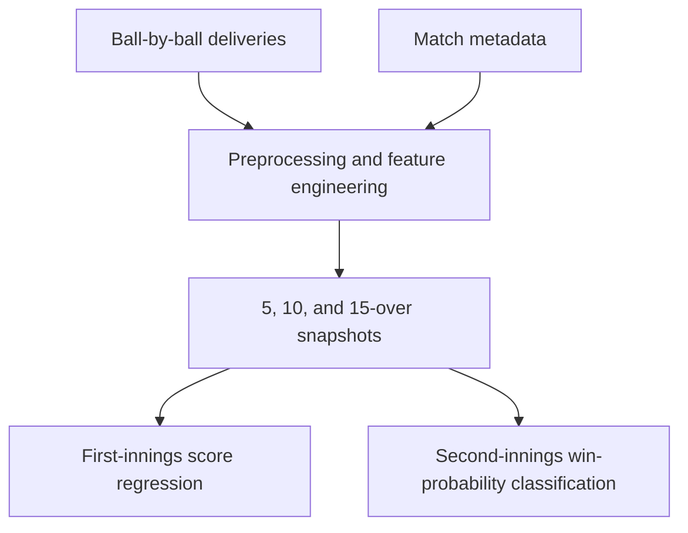

<div align="center">

# WASP-IPL

### Winning and Score Predictor for Indian Premier League matches

A machine-learning project that predicts a team's first-innings final score and estimates the chasing team's second-innings win probability from the live match state.

[](https://www.python.org/)
[](https://jupyter.org/)
[](https://scikit-learn.org/)
[](https://xgboost.readthedocs.io/)

</div>

## Overview

Cricket matches can change dramatically with every run and wicket. WASP-IPL models that evolving match state at three checkpoints - after 5, 10, and 15 overs - to answer two questions:

1. **First innings:** What final total is the batting team likely to reach?
2. **Second innings:** What is the probability that the chasing team will win?

The project uses ball-by-ball IPL data from **2008 to 2019**, combines match context with player and team features, and evaluates multiple machine-learning models before combining them in ensembles.

## Highlights

- Two complementary prediction tasks: final-score regression and win-probability classification
- Match-state snapshots after 5, 10, and 15 overs
- Features covering teams, venue, batters, bowler, score, wickets, balls, target, and run rates
- Decision Tree, Random Forest, linear/logistic, and XGBoost models
- Voting-based ensembles for the final predictions
- Included visual analysis and an IPL 2017 match case study

## How it works



### Prediction tasks

| Task | Target | Important match-state features | Final ensemble |
| --- | --- | --- | --- |
| First-innings score prediction | Final innings total | Current score, wickets remaining, balls bowled, teams, city, batter, non-striker, bowler, batter runs, bowler wickets | `VotingRegressor` with Decision Tree, Random Forest, and XGBoost |
| Second-innings win probability | Chase result and class probability | Current score, target, runs/balls remaining, wickets remaining, current run rate, required run rate, teams, city, batter, and bowler | Soft-voting `VotingClassifier` with Logistic Regression, Decision Tree, Random Forest, and XGBoost |

Categorical variables are one-hot encoded, while numerical features used by the linear and logistic models are standardized. The second-innings preprocessing also excludes Duckworth-Lewis-affected matches and normalizes selected historical franchise names.

## Dataset

The data is packaged inside `WASP Project-20240513T194001Z-001.zip`.

| File | Contents | Records |
| --- | --- | ---: |
| `matches.csv` | Season, date, location, teams, toss, match result, winner, and venue metadata | 756 matches |
| `deliveries.csv` | Ball-by-ball batting, bowling, run, extras, and dismissal information | 179,077 deliveries |

The archive also contains intermediate feature tables, experimental notebooks, and a serialized pipeline artifact used during development.

## Results

The following ensemble results are reported in the included project documentation:

| Match checkpoint | First-innings score prediction (R²) | Second-innings winner prediction (accuracy) |
| ---: | ---: | ---: |
| 5 overs | -0.1224 | 68.80% |
| 10 overs | 0.2767 | 70.19% |
| 15 overs | **0.7851** | **71.77%** |

The score model improves substantially as more of the first innings is observed. The win-probability model also becomes more accurate as the chase develops and the required match context becomes clearer.

> **Results note:** These values are from the documented experiment. Exact rerun values can differ because the current notebooks do not set a random seed for every estimator.

## Example: SRH vs RCB, IPL 2017

For the included case study, Sunrisers Hyderabad scored **207** and defeated Royal Challengers Bangalore by **35 runs**.

| Checkpoint | Predicted SRH first-innings total | RCB chase win probability |
| ---: | ---: | ---: |
| 5 overs | 154 | 17.50% |
| 10 overs | 166 | 11.45% |
| 15 overs | 193 | 10.03% |
| Final outcome | 207 | RCB lost |

## Repository contents

| Path | Description |
| --- | --- |
| [`wasp_1st_innings_ipynb (1).ipynb`](./wasp_1st_innings_ipynb%20%281%29.ipynb) | Feature engineering, regression models, ensembles, and plots for first-innings score prediction |
| [`wasp_2nd_innings.ipynb`](./wasp_2nd_innings.ipynb) | Feature engineering, classifiers, soft-voting ensembles, probabilities, and plots for second-innings prediction |
| [`WASP Model documentation.pdf`](./WASP%20Model%20documentation.pdf) | Full project overview, methodology, results, visualizations, case study, and future work |
| `WASP Project-20240513T194001Z-001.zip` | Raw datasets, intermediate data, and supporting development artifacts |

## Getting started

### 1. Clone and extract the project

```bash
git clone https://github.com/fridayyy3000/WASP-IPL-.git
cd WASP-IPL-
unzip "WASP Project-20240513T194001Z-001.zip"
```

### 2. Install the dependencies

Python 3.10 is recommended for compatibility with the original notebooks. They use `DataFrame.append`, which was removed in pandas 2.0.

```bash
python -m venv .venv
source .venv/bin/activate
python -m pip install --upgrade pip
pip install jupyter "numpy<2" "pandas<2" scikit-learn xgboost matplotlib seaborn
```

On Windows PowerShell, activate the environment with:

```powershell
.venv\Scripts\Activate.ps1
```

### 3. Run the notebooks

```bash
jupyter notebook
```

Open either prediction notebook and update its CSV paths to the extracted data directory:

```python
deliveries = pd.read_csv("WASP Project/deliveries.csv")
matches = pd.read_csv("WASP Project/matches.csv")
```

### Google Colab option

The notebooks were originally developed in Google Colab and currently reference:

```text
/content/drive/MyDrive/WASP Project/
```

To preserve those paths, extract the archive, upload the `WASP Project` directory to the root of Google Drive, and mount Drive before running the notebooks:

```python
from google.colab import drive
drive.mount("/content/drive")
```

## Reproducibility notes

- The repository preserves the original experiment-oriented notebooks; it is not yet packaged as a production inference service.
- The experiments use random held-out splits rather than a chronological season-based evaluation.
- Some tree-based estimators do not currently define `random_state`, so repeated runs may produce slightly different values.
- To use pandas 2.0 or newer, replace the deprecated row-by-row `DataFrame.append` calls with `pd.concat`.
- In the current second-innings notebook, the 15-over training block references `data_10` and reuses earlier Decision Tree and Random Forest variables. Change these references to `data_15`, `dtc_15`, and `rf_15` before treating a rerun as an independent 15-over experiment.

## Future improvements

- Refactor preprocessing and training into reusable Python modules and scikit-learn pipelines
- Add season-based cross-validation and probability-calibration metrics
- Persist the trained models and preprocessing artifacts for inference
- Build a live dashboard or API for ball-by-ball predictions
- Extend the data to recent IPL seasons and other cricket formats
- Add automated tests, pinned dependencies, and fully reproducible experiment configs

## Author

Built by **Gaurav Najpande** ([@fridayyy3000](https://github.com/fridayyy3000)).

## License

No license file is currently included. Please contact the repository owner before reusing or redistributing the project.
